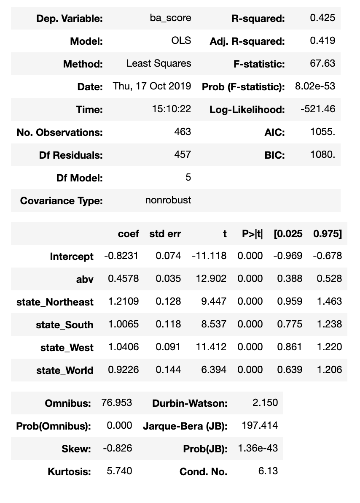
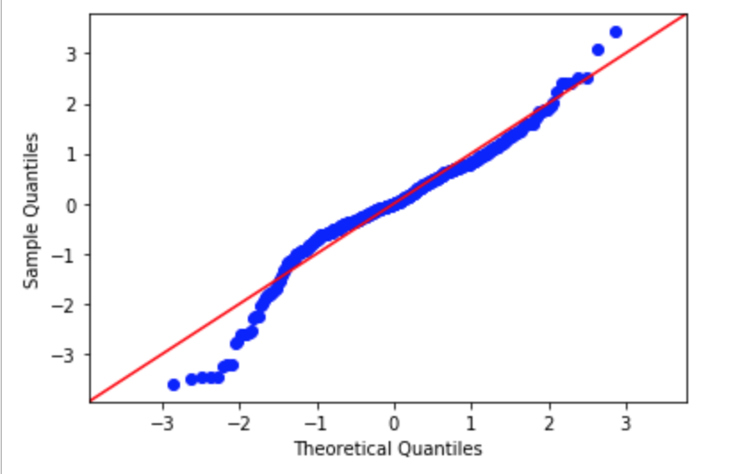
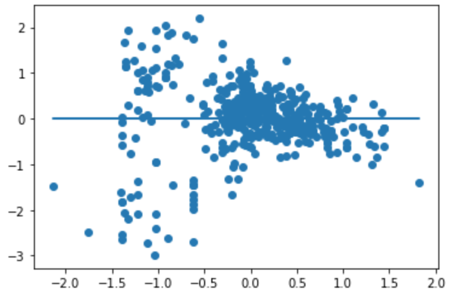

# Regression_Project
This project will take a look at the BeerAdvocate (BA) score for beers and perform regression analysis to determine what factors affect the score, and then build a model that can accurately predict the score given those parameters.

## Data Collection
We used the [BreweryDB](https://www.brewerydb.com) API to take a random sample of 1,000 beers from accross the world.
We then used both selenium and beautiful soup to search [BeerAdvocate](https://www.beeradvocate.com) for each of those beer and pull the following information for them: BA score, user rating, number of reviews, ABV, style, brewery location, beer availability.

## Data Cleaning
We chose to drop the 10% of our data that had no BA score, and categorized the beer styles and brewery location.
We then turned our 3 categorical variables (region, style, availability) into dummy variables.

## Data Exploration
We looked at the correlation between variables, and chose to drop user rating as it is directly correlated to the BA score.

Then we looked at normality of distribution and decided that log transformations did not have an effect on the distribution, so we proceeded as is and standardized our data.
## Regression Analysis
Then, taking an iterative approach we looked at how each of our variables affected the dependant variable, BA score.
For our final model, we kept only ABV and Brewery Location as the other variables did not have an effect on the dependant variable. And achieved an R-squared value of 0.425.

We also checked the assumptions of linearity, Homogeneity of Variance (Homoscedasticity), and the distribution of the error.
the q-q plot shows that the error is, more or less, normally distributed:

Looking at the residual plot we see that there might not be homoscedasticity.

## Conclusions
From our iterative regression analysis, we concluded that only ABV and Location had an effect on BA Score, and number of reviews, style and availability did not affect it at all. However, our model does not perfectly follow the assumptions and has a rather low R-squared value.
